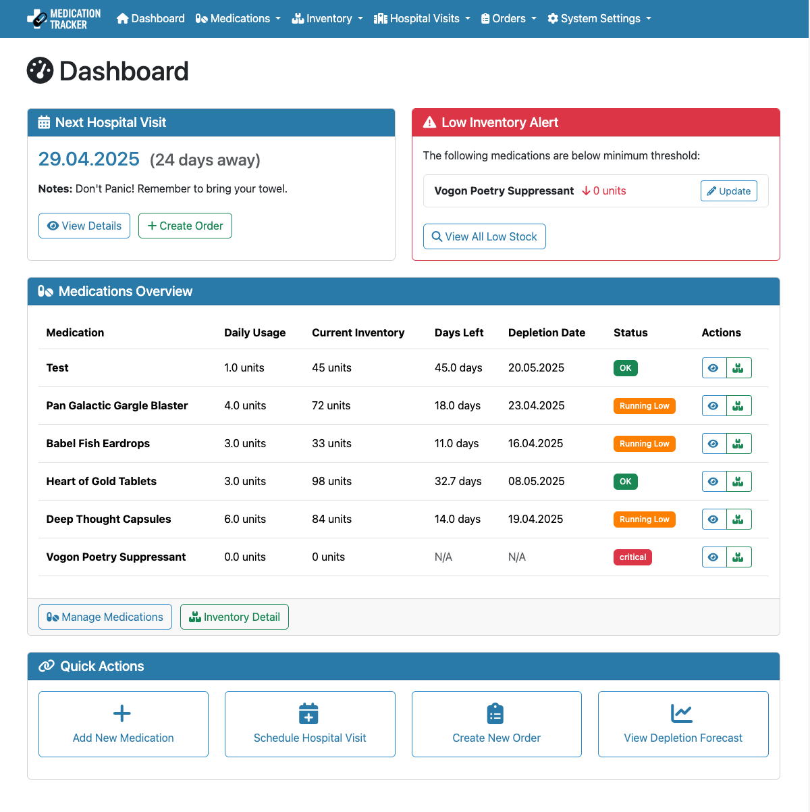
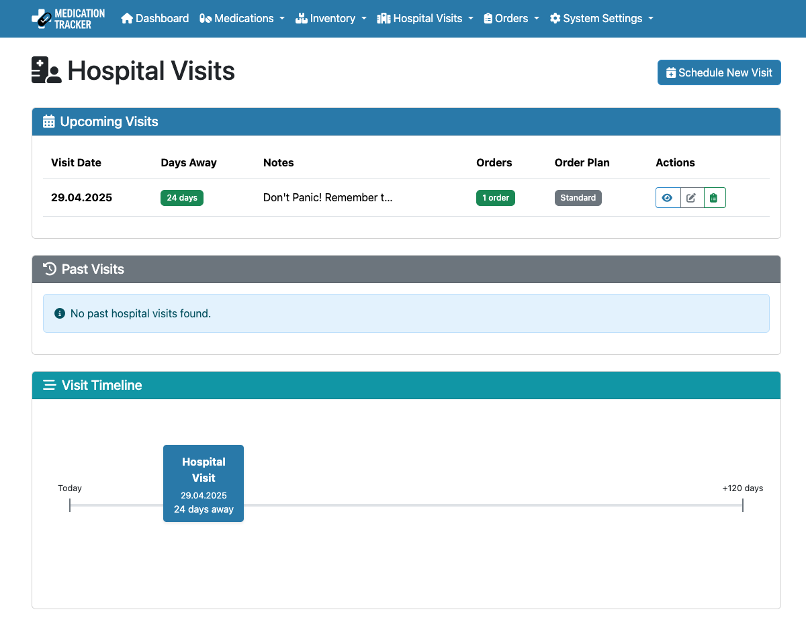

<p align="center">
  
</p>

<p align="center">
  A lightweight Python-based web application that helps track medications, inventory levels, and prepare for physician visits, using SQLite for data storage.
</p>

<p align="center">
  <a href="https://hub.docker.com/r/skjall/medication-tracker">
    
  </a>
  <a href="https://github.com/skjall/medication-tracker/releases">
    
  </a>
  <a href="https://opensource.org/licenses/MIT">
    
  </a>
  <a href="https://github.com/skjall/medication-tracker/actions">
    
  </a>
  <a href="https://crowdin.com/project/medication-tracker">
    
  </a>
  <a href="https://github.com/skjall/medication-tracker/issues">
    
  </a>
  <a href="https://github.com/skjall/medication-tracker/stargazers">
    
  </a>
</p>

## 🌍 Multi-Language Support

Medication Tracker is available in multiple languages with professional translations managed through [Crowdin](https://crowdin.com/project/medication-tracker). Languages are automatically enabled when translation completion reaches 80%.

**Currently Available Languages:**
- 🇺🇸 **English** - Base language (100%)
- 🇩🇪 **Deutsch** - Available when >80% complete
- 🇪🇸 **Español** - Available when >80% complete  
- 🇫🇷 **Français** - Available when >80% complete

### 🤝 Help Translate

We welcome contributions to make Medication Tracker accessible to more users worldwide!

#### **For Translators:**
1. **Join our Crowdin project**: [crowdin.com/project/medication-tracker](https://crowdin.com/project/medication-tracker)
2. **Select your language** from the list or request a new one
3. **Start translating** using Crowdin's intuitive web interface
4. **No technical knowledge required** - just help make the app accessible!

#### **Translation Benefits:**
- 🌐 **Web-based interface** - No software installation needed
- 💡 **Context provided** - See exactly where text appears in the app
- 🔄 **Translation memory** - Reuse previous translations for consistency
- 👥 **Collaborative** - Work with other translators and reviewers
- ✅ **Quality assurance** - Built-in checks for translation quality

#### **For Developers/Advanced Users:**
```bash
# Extract new translatable strings
cd app && pybabel extract -F ../babel.cfg -k _ -o ../translations/messages.pot .

# Update existing translations
pybabel update -i translations/messages.pot -d translations

# Check translation coverage
./scripts/translation-coverage.sh

# Upload to Crowdin (requires API token)
crowdin upload sources
```

**Language automatically appears in the navigation menu when 80% translation is complete!**

---

## Features

- **Medication Management**:
  - Track medication dosage, frequency, and package sizes
  - Advanced scheduling options (daily, interval, or specific weekdays)
  - Automatic inventory deduction based on schedules

- **Inventory Tracking**:
  - Real-time inventory monitoring with low stock warnings
  - Package-based inventory management (N1, N2, N3 sizes)
  - Full history of inventory changes with timestamps

- **Physician Management**:
  - Organize medications by prescribing physician
  - Track physician specialties, contact information, and notes
  - Associate visits with specific physicians
  - Mark medications as Over-The-Counter (OTC) or supplements

- **Physician Visit Planning**:
  - Schedule and manage upcoming physician visits
  - Calculate medication needs until next visit
  - Support for next-but-one visit planning

- **Order Management**:
  - Create medication orders for physician visits
  - Calculate package requirements based on needs
  - Generate printable order forms
  - Track order fulfillment and update inventory

- **Data Management**:
  - Import/export data for all system components
  - CSV import/export for medications, inventory, visits, and orders
  - Database backup and optimization tools

- **Multi-Language Support**:
  - Professional translation management via Crowdin
  - Automatic language switching based on completion
  - Support for 25+ languages with proper localization

## Access Warning

⚠️ **This software has no access protection. Users are advised to not expose any sensitive information and to only deploy it on local networks or behind appropriate security measures. The application is intended for personal use and should not be publicly accessible.**

## Screenshots

### Dashboard


### Medication Details


### Inventory Management


### Physician Visits


# 🚀 Running the application

## Using Docker

```bash
docker run -d \
  --name medication-tracker \
  -p 8087:8087 \
  -v medication_tracker_data:/app/data \
  -v medication_tracker_logs:/app/logs \
  -e SECRET_KEY=your_secure_secret_key \
  skjall/medication-tracker:latest
```

Then access the application at http://localhost:8087

## Using Docker Compose

1. Create a docker-compose.yml file:

```yaml
version: '3.8'

services:
  medication-tracker:
    image: skjall/medication-tracker:latest
    container_name: medication-tracker
    ports:
      - '8087:8087'
    volumes:
      - medication_tracker_data:/app/data
      - medication_tracker_logs:/app/logs
    restart: unless-stopped
    environment:
      - FLASK_ENV=production
      - SECRET_KEY=change_me_in_production
      - LOG_LEVEL=INFO
      - FLASK_DEFAULT_LANGUAGE=en  # Optional: set default language

volumes:
  medication_tracker_data:
  medication_tracker_logs:
```

2. Start the application:

```bash
docker-compose up -d
```

3. Access the application at http://localhost:8087

## Environment Variables

- `SECRET_KEY`: Secret key for session signing (required in production)
- `FLASK_ENV`: Set to `production` for production use
- `LOG_LEVEL`: Set logging level (`DEBUG`, `INFO`, `WARNING`, `ERROR`, or `CRITICAL`)
- `FLASK_DEFAULT_LANGUAGE`: Default language for new users (`en`, `de`, `es`, `fr`, etc.)

## Data Persistence

All data is stored in SQLite databases in the `/app/data` directory. To persist your data, mount this directory as a volume.

## 📚 Usage Guide

### Changing Language

1. **Click the globe icon** 🌍 in the top navigation bar
2. **Select your preferred language** from the dropdown
3. **Language preference is saved** for your browser session
4. **Only languages with >80% translation completion** are shown

You can also switch languages by adding `?lang=de` (or your language code) to any URL.

### Managing Physicians

1. Navigate to "Physicians" → "Add Physician"
2. Enter physician details including name, specialty, and contact information
3. Associate medications with specific physicians during medication creation
4. View all medications and visits for each physician in one place

### Adding Medications

1. Navigate to "Medications" → "Add Medication"
2. Enter medication details including name, dosage, package sizes
3. Select the prescribing physician or mark as Over-The-Counter (OTC)
4. Set up medication schedules to define when and how much to take
5. Enable automatic deduction for seamless inventory management

### Managing Inventory

1. Navigate to "Inventory" → "Inventory Overview"
2. Use the quick adjust buttons to update inventory levels
3. View low stock warnings and depletion forecasts
4. Track inventory changes with detailed history logs

### Scheduling Physician Visits

1. Navigate to "Physician Visits" → "Schedule Visit"
2. Enter the date of your upcoming visit
3. Select the physician you're visiting
4. Optionally create an order for the visit
5. Choose between regular ordering or next-but-one planning

### Creating Orders

1. Navigate to "Orders" → "New Order"
2. Select medications needed until your next visit
3. Review automatically calculated package requirements
4. Generate a printable order form for your physician visit
5. Mark as fulfilled when medications are received to update inventory

## 🛠️ Building from Source

If you want to build the Docker image yourself:

```bash
git clone https://github.com/skjall/medication-tracker.git
cd medication-tracker
docker buildx build -t medication-tracker --build-arg VERSION=$(cat version.txt) .
```

## 📋 Versioning

The application follows semantic versioning:

- Main branch: Uses explicit version from `version.txt` file
- Development branch: Auto-generates version with format `dev-YYYYMMDDHHMM-commit`
- Tagged releases: Use the tag version (e.g., `v1.0.0` → `1.0.0`)

To update the version:

```bash
# Increment patch version (1.0.0 → 1.0.1)
./scripts/update_version.sh patch

# Increment minor version (1.0.0 → 1.1.0)
./scripts/update_version.sh minor

# Increment major version (1.0.0 → 2.0.0)
./scripts/update_version.sh major

# Update, commit, and tag in one command
./scripts/update_version.sh patch --commit --tag
```

## 🔧 Development Setup

To set up a development environment:

1. Clone the repository
2. Create a virtual environment:
   ```bash
   python -m venv .venv
   source .venv/bin/activate  # On Windows: .venv\Scripts\activate
   ```
3. Install dependencies:
   ```bash
   pip install -r requirements.txt
   ```
4. Run the application:
   ```bash
   python app/main.py
   ```
5. Access the application at http://localhost:8087

### Translation Development

```bash
# Check translation coverage
./scripts/translation-coverage.sh

# Prime Crowdin (first-time setup)
./scripts/crowdin-prime.sh

# Check Crowdin status
./scripts/crowdin-status.sh

# View translation debug info
curl http://localhost:8087/debug/translation-coverage
```

## 🤝 Contributing

We welcome contributions! Here are some ways you can help:

### 🌐 **Translations** (No coding required!)
- Join our [Crowdin project](https://crowdin.com/project/medication-tracker)
- Help translate the app into your language
- Review and improve existing translations

### 💻 **Code Contributions**
- Report bugs and suggest features via [GitHub Issues](https://github.com/skjall/medication-tracker/issues)
- Submit pull requests for bug fixes and improvements
- Help improve documentation

### 📖 **Documentation**
- Improve user guides and documentation
- Add screenshots and usage examples
- Translate documentation into other languages

## 📄 License

This project is licensed under the MIT License - see the [LICENSE.md](LICENSE.md) file for details.

---

<p align="center">
  Made with ❤️ for better medication management
</p>

<p align="center">
  <a href="https://crowdin.com/project/medication-tracker">🌍 Help translate</a> •
  <a href="https://github.com/skjall/medication-tracker/issues">🐛 Report bug</a> •
  <a href="https://github.com/skjall/medication-tracker/discussions">💬 Discussions</a>
</p>